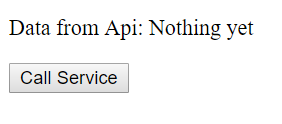
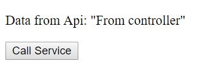

Angular 4 & OWIN Web Api

1. Create VS Project
    1. New Project - ASP.Net Web Application (.Net Framework) - Name: ng4owin
    2. Template: Empty

2. Add OWIN
    1. Add NuGet Package: Microsoft.Owin.Host.SystemWeb
    2. Add New Item - OWIN Startup class - Name: Startup.cs
        ```csharp
        using Microsoft.Owin;
        using Owin;

        [assembly: OwinStartup(typeof(ng4owin.Startup))]
        namespace ng4owin
        {
            public class Startup
            {
                public void Configuration(IAppBuilder app)
                {
                    app.Run(context =>
                    {
                        context.Response.ContentType = "text/plain";
                        return context.Response.WriteAsync("OWIN here!");
                    });
                }
            }
        }
        ```
    3. Run and test by hitting **F5**. The default browser should open in "http://localhost:59125/" (59125 is a randomly generated port generated by Visual Studio for debug) and display:
        ```
        OWIN here!
        ```

3. Add Web Api
    1. Add Nuget Package: Microsoft.AspNet.WebApi.Owin
    2. Add Web Api Middleware and configure routes in *Startup.cs*:
        ```csharp
        using Microsoft.Owin;
        using Owin;
        using System.Web.Http;

        [assembly: OwinStartup(typeof(ng4owin.Startup))]
        namespace ng4owin
        {
            public class Startup
            {
                public void Configuration(IAppBuilder app)
                {
                    var apiConfig = new HttpConfiguration();
                    apiConfig.Routes.MapHttpRoute("default", "api/{controller}/{action}");
                    app.UseWebApi(apiConfig);

                    app.Run(context =>
                    {
                        context.Response.ContentType = "text/plain";
                        return context.Response.WriteAsync("OWIN here!");
                    });
                }
            }
        }
        ```
    3. Create an Api controller
        1. (optional) Create a project folder called ```Api```
        2. Add - Controller... - Web Api 2 Controller - Empty - Controller Name: SimpleController
        3. Add action to controller, in *SimpleController.cs*
            ```csharp
            using System.Web.Http;

            namespace ng4owin.Api
            {
                public class SimpleController : ApiController
                {
                    public string Get()
                    {
                        return "From controller";
                    }
                }
            }
            ```
        4. Run and test by hitting **F5**. The default browser should open, as before, but, now, add the controller action to the path, i.e., "http://localhost:59125/api/Simple/Get", and the following shoudl display:
            ```
            From controller
            ```
            
            *Note*: There might be some wrapping on the browser display, depending on the accept sent by the browser. E.g, Firefox displays ```<string>From controller</string>``` and Edge displays ```"From controller"```
        
4. Add Static Files Support
    1. NuGet Package: Microsoft.Owin.StaticFiles
    2. Add Static Files Middleware and configura root path in *Startup.cs*:
        ```csharp
        using Microsoft.Owin;
        using Microsoft.Owin.FileSystems;
        using Microsoft.Owin.StaticFiles;
        using Owin;
        using System.Web.Http;

        [assembly: OwinStartup(typeof(ng4owin.Startup))]
        namespace ng4owin
        {
            public class Startup
            {
                public void Configuration(IAppBuilder app)
                {
                    var apiConfig = new HttpConfiguration();
                    apiConfig.Routes.MapHttpRoute("default", "api/{controller}/{action}");
                    app.UseWebApi(apiConfig);

                    var fileSystem = new PhysicalFileSystem("wwwroot");
                    var staticFilesConfig = new FileServerOptions
                    {
                        FileSystem = fileSystem
                    };
                    app.UseFileServer(staticFilesConfig);

                    app.Run(context =>
                    {
                        context.Response.ContentType = "text/plain";
                        return context.Response.WriteAsync("OWIN here!");
                    });
                }
            }
        }
        ```
    3. Change ```web.config``` to use OWIN Handler
        ```xml
        <?xml version="1.0"?>
        <configuration>
        <system.webServer>
            <handlers>
            <clear/>
            <add name="Owin" verb="" path="*" type="Microsoft.Owin.Host.SystemWeb.OwinHttpHandler, Microsoft.Owin.Host.SystemWeb"/>
            </handlers>
        </system.webServer>
        <runtime>
            <assemblyBinding xmlns="urn:schemas-microsoft-com:asm.v1">
            <dependentAssembly>
                <assemblyIdentity name="Microsoft.Owin" publicKeyToken="31bf3856ad364e35" culture="neutral" />
                <bindingRedirect oldVersion="0.0.0.0-3.1.0.0" newVersion="3.1.0.0" />
            </dependentAssembly>
            </assemblyBinding>
        </runtime>
        <system.web>
            <compilation debug="true"/>
        </system.web>
        </configuration>
        ```
    4. Create ```wwwroot``` folder
    5. Add test file
        1. Add - New Item... - Text File - Name: test.txt
            ```
            Static content
            ```
    6. Run and test by hittin **F5**. The default browser should open, as before, but, now, add the file name to the path, i.e., "http://localhost:59125/test.txt", and the following shoudl display:
        ```
        Static content
        ```

5. Create Angular 4 application
    1. Install/Update [Nodejs and npm](https://docs.npmjs.com/getting-started/installing-node)
    2. Install/update [Angular CLI](https://github.com/angular/angular-cli#installation)
    3. Create the app from the folder parent to the project's folder (e.g., where the ```.sln``` file is), in the command prompt
        ```
        ng new ng4owin --routing
        ```
        Thatt should output something like this:
        ```
        installing ng
        create .editorconfig
        create README.md
        create src\app\app-routing.module.ts
        create src\app\app.component.css
        create src\app\app.component.html
        create src\app\app.component.spec.ts
        create src\app\app.component.ts
        create src\app\app.module.ts
        create src\assets\.gitkeep
        create src\environments\environment.prod.ts
        create src\environments\environment.ts
        create src\favicon.ico
        create src\index.html
        create src\main.ts
        create src\polyfills.ts
        create src\styles.css
        create src\test.ts
        create src\tsconfig.app.json
        create src\tsconfig.spec.json
        create src\typings.d.ts
        create .angular-cli.json
        create e2e\app.e2e-spec.ts
        create e2e\app.po.ts
        create e2e\tsconfig.e2e.json
        create .gitignore
        create karma.conf.js
        create package.json
        create protractor.conf.js
        create tsconfig.json
        create tslint.json
        Directory is already under version control. Skipping initialization of git.
        Installing packages for tooling via npm.
        Installed packages for tooling via npm.
        Project 'ng4Owin' successfully created.
        ```
    4. Run and test
        1. Ind the command line:
            1. Change (cd) to ```ng4owin``` directory (project folder)
            2. Run
                ```
                ng serve
                ```
                That, after some processing, should display something like this:
                ```
                ** NG Live Development Server is listening on localhost:4200, open your browser on http://localhost:4200 **
                Hash: 0fdcb13ff7fb96579f93
                Time: 14185ms
                chunk    {0} polyfills.bundle.js, polyfills.bundle.js.map (polyfills) 158 kB {4} [initial] [rendered]
                chunk    {1} main.bundle.js, main.bundle.js.map (main) 6.58 kB {3} [initial] [rendered]
                chunk    {2} styles.bundle.js, styles.bundle.js.map (styles) 10.5 kB {4} [initial] [rendered]
                chunk    {3} vendor.bundle.js, vendor.bundle.js.map (vendor) 2.4 MB [initial] [rendered]
                chunk    {4} inline.bundle.js, inline.bundle.js.map (inline) 0 bytes [entry] [rendered]
                webpack: Compiled successfully.
                ```
            3. Open a browser with the URL displayed, i.e., ```http://localhost:4200```, that should display:
                

                *Notes*: 
                - In this moment, every time a file is saved in the Angular App project, **ng** (Angular CLI) re-compiles, re-packages and re-loads the browser;
                - **ng serve** does not compile and package into the file system but to an in-memory process. *Building*, is a seperate process, addressed later.
            4. Stop
                - In the command-line (running **ng serve**) hit *Ctrl+C*

6. Add Angular application to Visual Studio project:
    1. Install [npm Task Runner](https://marketplace.visualstudio.com/items?itemName=MadsKristensen.NPMTaskRunner)
    2. Set *External Web Tools* order by
        1. Going to *Tools* - *Options* - *Projects and Solutions* - *Web Package Management* - *External Web Tools*
        2. Put ```$(PATH)``` at the top of the list
    3. Include files in project. In Visual Studio:
        1.  Toggle *Show All Files* ()
        2. delete uncessary files:
            - ```.editorconfig```
            - ```.gitignore```
        3. Right-click and select *Include In Project* on:
            - ```e2e``` folder
            - ```src``` folder
            - ```src``` folder
            - all the hidden files in project's root folder
        
        *Note*: 
        - **DOT NOT include ```node_modules``` folder**. It's not useful and takes ages to include the 20k+ files (180MB+).
    4. Edit project file (unloading the project or in another editor) and add this property to the top ```<PropertyGroup>...</PropertyGroup>``` to prevent Visual Studio from transpiling **TypeScript** (**.ts**) files:
        ```xml
        <TypeScriptCompileBlocked>true</TypeScriptCompileBlocked>
        ```
    5. Set Angular build (**ng build**) output folder to ```wwwroot```, in ```.angular-cli.json```:
        ```json
        {
            //.. other content
            "apps": [
                {
                "root": "src",
                "outDir": "wwwroot",
                //.. other content
                }
            ],
            //.. other content
            }
        ```
    6. Set *build* to run on project build.
        1. Right-click ```pacakge.json``` - *Task Runner Explorer*
        2. Right-click *package.json - Custom - build*
        3. Select *Bindings - After Build*
    7. Configure *Static Files Middleware* to default to ```index.html``` in ```Startup.cs```
        ```csharp
        using Microsoft.Owin;
        using Microsoft.Owin.FileSystems;
        using Microsoft.Owin.StaticFiles;
        using Owin;
        using System.Web.Http;

        [assembly: OwinStartup(typeof(ng4owin.Startup))]
        namespace ng4owin
        {
            public class Startup
            {
                public void Configuration(IAppBuilder app)
                {
                    var apiConfig = new HttpConfiguration();
                    apiConfig.Routes.MapHttpRoute("default", "api/{controller}/{action}");
                    app.UseWebApi(apiConfig);

                    var fileSystem = new PhysicalFileSystem("wwwroot");
                    var staticFilesConfig = new FileServerOptions
                    {
                        FileSystem = fileSystem
                    };
                    staticFilesConfig.DefaultFilesOptions.DefaultFileNames = new[] 
                    {
                        "index.html"
                    };

                    app.UseFileServer(staticFilesConfig);

                    app.Run(context =>
                    {
                        context.Response.ContentType = "text/plain";
                        return context.Response.WriteAsync("OWIN here!");
                    });
                }
            }
        }
        ```
    8. Run and test by hitting **F5**. The default browser should open in "http://localhost:59125/" and display the Angular applicaiton as before:
        

7. Add a client Service to call the Web Api
    1. Add *New Item* to ```src/app``` folder named ```simple.service.ts```
        ```typescript
        import { Injectable } from '@angular/core';
        import { Http } from "@angular/http";
        import 'rxjs/add/operator/toPromise';

        const apiBaseUrl = "api/";

        @Injectable()
        export class SimpleService {

            constructor(private http: Http) { }

            get(): Promise<string> {
                return this.http.get(`${apiBaseUrl}Simple/Get`)
                    .toPromise()
                    .then(response => response.text());
            }
        }
        ```
    2. ```src/app/app.module.ts```, import ```HttpModule``` and add ```SimpleService``` to the providers array
        ```typescript
        import { BrowserModule } from '@angular/platform-browser';
        import { NgModule } from '@angular/core';
        import { HttpModule } from "@angular/http";

        import { AppRoutingModule } from './app-routing.module';
        import { AppComponent } from './app.component';
        import { SimpleService } from "./simple.service";

        @NgModule({
            declarations: [
                AppComponent
            ],
            imports: [
                BrowserModule,
                HttpModule,
                AppRoutingModule
            ],
            providers: [
                SimpleService
            ],
            bootstrap: [AppComponent]
        })
        export class AppModule { }
        ```
    3. Implement the Http call in ```src/app/simple.service.ts```
        ```typescript
        import { Injectable } from '@angular/core';
        import { Http } from "@angular/http";
        import 'rxjs/add/operator/toPromise';

        const apiBaseUrl = "http://localhost:60478/api/";

        @Injectable()
        export class SimpleService {

            constructor(private http: Http) { }

            get(): Promise<string> {
                return this.http.get(`${apiBaseUrl}Simple/Get`)
                    .toPromise()
                    .then(response => response.text());
            }
        }
        ```
    4. Use ```SimpleService``` in ```AppComponent```, ```src/app/app.component.ts```
        ```typescript
        import { Component } from '@angular/core';
        import { SimpleService } from "./simple.service";

        @Component({
            selector: 'app-root',
            templateUrl: './app.component.html',
            styleUrls: ['./app.component.css']
        })
        export class AppComponent {
            constructor(private simpleService: SimpleService) { }
            data = "Nothing yet";
            callService(): void {
                this.simpleService.get().then(serviceData => this.data = serviceData);
            }
        }
        ```
    5. Change ```AppComponent``` template to display trigger the service call and display service response data:
        ```html
        <p>Data from Api: {{data}}</p>
        <button (click)="callService()">Call Service</button>
        ```
    6. Run and test . Assuming Web project (**F5** in Visual Studio) and Angular (**ng serve** in the command line) are running, the browser should display first:
        
        
        
        and, after clicking ```Call Service``` button, should display:
        
        

8. Build watch Angular application
    1. Remove previous *build* task binding

    2. Add script in ```pacakge.json```
        ```json
        {
            // other content
            "scripts": {
                "ng": "ng",
                "start": "ng serve",
                "build": "ng build",
                "build-watch": "ng build --watch",
                "test": "ng test",
                "lint": "ng lint",
                "e2e": "ng e2e"
            },
            //other content
        }
        ```
    3. Set tase bidning, in ```pacakge.json```
        ```json
        {
            // other content
            "-vs-binding": {
            "ProjectOpened": [
            "build-watch"
            ]        
        }
        ```
        This will re-compile and re-package the Angular application into ```wwwroot``` folder.

    4. Since the project is already opened, run ```bluid-watch``` in *Task Runner Explorer*:
        1. Right-click *package.json* - *Custom* - *build-watch*
        2. Select *Run*

9. Debugging
    Running in *Google Chrome* will enable debugging both the client **.ts** files and the server (Api) **.cs** files.
    